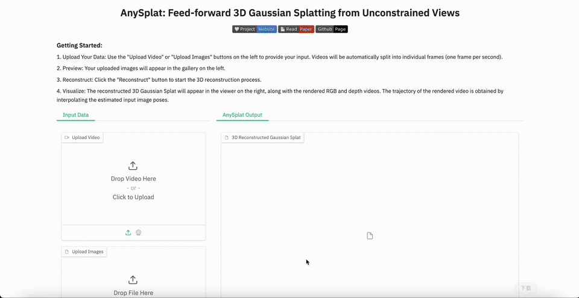

# AnySplat: Feed-forward 3D Gaussian Splatting from Unconstrained Views

[](https://city-super.github.io/anysplat/)
[](https://arxiv.org/pdf/2505.23716)
[](https://huggingface.co/spaces/alexnasa/AnySplat)
[](https://huggingface.co/lhjiang/anysplat)

[Lihan Jiang*](https://jianglh-whu.github.io/), [Yucheng Mao*](https://myc634.github.io/yuchengmao/), [Linning Xu](https://eveneveno.github.io/lnxu),
[Tao Lu](https://inspirelt.github.io/), [Kerui Ren](https://github.com/tongji-rkr), [Yichen Jin](), [Xudong Xu](https://scholar.google.com.hk/citations?user=D8VMkA8AAAAJ&hl=en), [Mulin Yu](https://scholar.google.com/citations?user=w0Od3hQAAAAJ), [Jiangmiao Pang](https://oceanpang.github.io/), [Feng Zhao](https://scholar.google.co.uk/citations?user=r6CvuOUAAAAJ&hl=en), [Dahua Lin](http://dahua.site/), [Bo Dai<sup>†</sup>](https://daibo.info/) <br />

## News
**[2024.07.08]** We thank [Alex Nasa](https://huggingface.co/alexnasa) for providing us with an excellent [Huggingface demo](https://huggingface.co/spaces/alexnasa/AnySplat).

**[2024.06.30]** We release the training & inference code.

## Overview
<p align="center">

</p>

Starting from a set of uncalibrated images, a transformer-based geometry encoder is followed by three decoder heads: <i>F<sub>G</sub></i>, <i>F<sub>D</sub></i>, and <i>F<sub>C</sub></i>, which respectively predict the Gaussian parameters (μ, σ, r, s, c), the depth map <i>D</i>, and the camera poses <i>p</i>. These outputs are used to construct a set of pixel-wise 3D Gaussians, which is then voxelized into pre-voxel 3D Gaussians with the proposed Differentiable Voxelization module. From the voxelized 3D Gaussians, multi-view images and depth maps are subsequently rendered. The rendered images are supervised using an RGB loss against the ground truth image, while the rendered depth maps, along with the decoded depth <i>D</i> and camera poses <i>p</i>, are used to compute geometry losses. The geometries are supervised by pseudo-geometry priors obtained by the pretrained VGGT.

## Installation
Our code relies on Python 3.10+, and is developed based on PyTorch 2.2.0 and CUDA 12.1, but it should work with other Pytorch/CUDA versions as well.

1. Clone AnySplat.
```bash
git clone https://github.com/OpenRobotLab/AnySplat.git
cd AnySplat
```

2. Create the environment, here we show an example using conda.
```bash
conda create -y -n anysplat python=3.10
conda activate anysplat
pip install torch==2.2.0 torchvision==0.17.0 torchaudio==2.2.0 --index-url https://download.pytorch.org/whl/cu121
pip install -r requirements.txt
```

## Quick Start

```

from pathlib import Path
import torch
import os
import sys
sys.path.append(os.path.dirname(os.path.dirname(os.path.abspath(__file__))))

from src.misc.image_io import save_interpolated_video
from src.model.model.anysplat import AnySplat
from src.utils.image import process_image

# Load the model from Hugging Face
model = AnySplat.from_pretrained("lhjiang/anysplat")
device = torch.device("cuda" if torch.cuda.is_available() else "cpu")
model = model.to(device)
model.eval()
for param in model.parameters():
    param.requires_grad = False

# Load and preprocess example images (replace with your own image paths)
image_names = ["path/to/imageA.png", "path/to/imageB.png", "path/to/imageC.png"] 
images = [process_image(image_name) for image_name in image_names]
images = torch.stack(images, dim=0).unsqueeze(0).to(device) # [1, K, 3, 448, 448]
b, v, _, h, w = images.shape

# Run Inference
gaussians, pred_context_pose = model.inference((images+1)*0.5)

pred_all_extrinsic = pred_context_pose['extrinsic']
pred_all_intrinsic = pred_context_pose['intrinsic']
save_interpolated_video(pred_all_extrinsic, pred_all_intrinsic, b, h, w, gaussians, image_folder, model.decoder)
```

## Training

```
# single node:
python src/main.py +experiment=dl3dv trainer.num_nodes=1

# multi nodes:
export GPU_NUM=8
export NUM_NODES=2
torchrun \
  --nnodes=$NUM_NODES \
  --nproc_per_node=$GPU_NUM \
  --rdzv_id=test \
  --rdzv_backend=c10d \
  --rdzv-endpoint=$MASTER_ADDR:$MASTER_PORT \
  -m src.main +experiment=multi-dataset +hydra.job.config.store_config=false
```

Here, we provide three example datasets ([CO3Dv2](https://github.com/facebookresearch/co3d), [DL3DV](https://dl3dv-10k.github.io/DL3DV-10K/) and [ScanNet++](https://kaldir.vc.in.tum.de/scannetpp/)), each representing a different training view sampling strategy. You can use them as templates and add any other datasets you prefer.

## Post Optimization

```
python src/post_opt/simple_trainer.py default --data_dir ...
```

## Evaluation

```
# Novel View Synthesis
python src/eval_nvs.py --data_dir ...

# Pose Estimation
python src/eval_pose.py --co3d_dir ... --co3d_anno_dir ...
```

## Dataset Preprocessing

We use the original data from the DL3DV datasets. For other datasets, please follow [CUT3R's data preprocessing instructions](https://github.com/naver/dust3r/tree/main?tab=readme-ov-file#datasets) to prepare training data.

## Demo

```
python demo_gradio.py
```

This will automatically download the pre-trained model weights and config from [Hugging Face Model](https://huggingface.co/lhjiang/anysplat).

The demo is a Gradio interface where you can upload images or a video and visualize the reconstructed 3D Gaussian Splat, along with the rendered RGB and depth videos. The trajectory of the rendered video is obtained by interpolating the estimated input image poses.



## Citation

If you find our work helpful, please consider citing:

```
@article{jiang2025anysplat,
  title={AnySplat: Feed-forward 3D Gaussian Splatting from Unconstrained Views},
  author={Jiang, Lihan and Mao, Yucheng and Xu, Linning and Lu, Tao and Ren, Kerui and Jin, Yichen and Xu, Xudong and Yu, Mulin and Pang, Jiangmiao and Zhao, Feng and others},
  journal={arXiv preprint arXiv:2505.23716},
  year={2025}
}
```

## Acknowledgement

We thank all authors behind these repositories for their excellent work: [VGGT](https://github.com/facebookresearch/vggt), [NoPoSplat](https://github.com/cvg/NoPoSplat), [CUT3R](https://github.com/CUT3R/CUT3R/tree/main) and [gsplat](https://github.com/nerfstudio-project/gsplat).